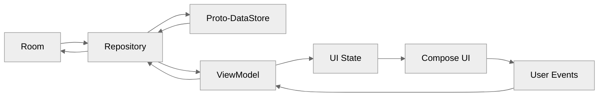
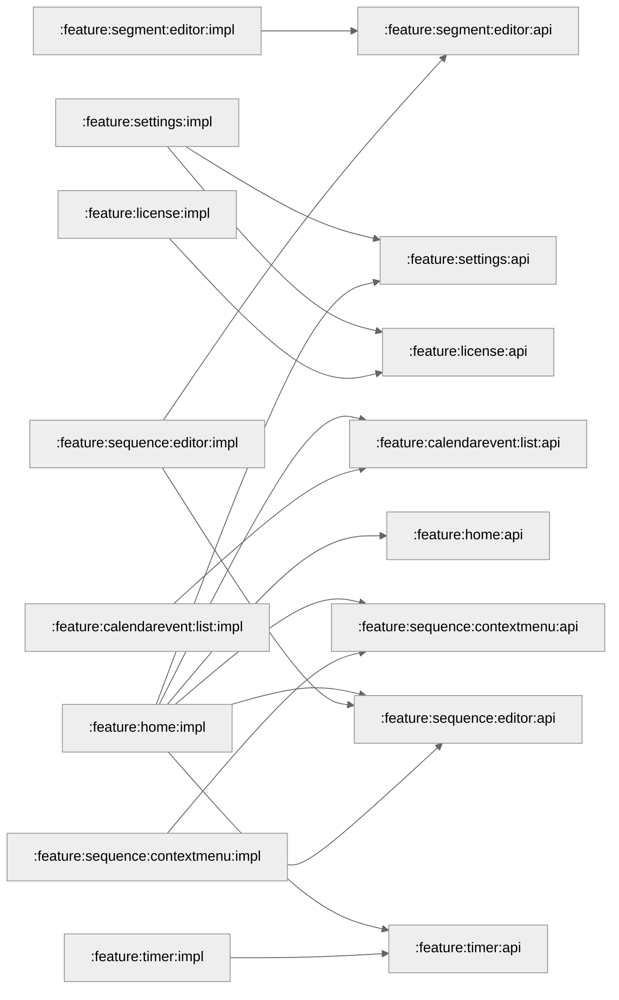

# Sequence

<table>
  <tr>
    <td>
      
    </td>
    <td>
      
    </td>
    <td>
      
    </td>
    <td>
      
    </td>
  </tr>
</table>

Sequence (stylized as SΞQUΞNCΞ) is a sequential timer for structured task execution.

In this app, individual **tasks** are configured as **segments**, and an organized group of these
segments is called a **sequence**.

## Features

- Configurable segment duration (days to seconds).
- Audio cues for completion and time depletion.
- Text-to-speech announcements for segment titles.
- Heatmap visualizing completion times.

## Quick Start

1. Clone the project: `git clone https://github.com/swdegay/Sequence.git`.
2. Open in Android Studio.
3. Sync Gradle and run the `:app` module.

## Development Environment

Use the latest stable Android Studio. If using a custom JDK, ensure it is version 17+ and configured
in [build.gradle.kts](build.gradle.kts).

## Design System

The UI blends a minimalist, monochrome aesthetic with fluid, interactive elements.

* **Card-Based & Accordion Layouts:** Encapsulates content into clean containers, using accordions
  to hide secondary information and reduce visual clutter.
* **Material 3 Expressive Motion:** Uses dynamic animations for tactile visual feedback, including
  loading indicators, long-press button transformations, and reactive FABs/Top App Bars.
* **Dynamic Theme Personalization:** Features a default monochrome theme with support for
  system-level color tokens (like Android's Material You) for a native, personalized look.

## Architecture

This project employs a multi-module, feature-based structure to ensure separation of concerns and
decoupled code.

### Core Frameworks and Paradigms

* **UI:** 100% Jetpack Compose and Material 3 Expressive on a single activity
* **Navigation:** Navigation3 (api and impl submodules)
* **Persistence:** Room for relational data and Proto-DataStore for preferences/key-value pairs.
* **Dependency Injection:** Hilt
* **Concurrency:** Kotlin Coroutines and Flow

### **Data Flow and State**

The repository acts as an aggregator for relational data and key-value pairs. State flows down from
the repository, consumed by the ViewModel, and exposed as a single UI state for the Compose UI.
Afterward, user events trigger a flow upwards which modify this state and changes flow back down
again to show UI state updates. The UseCase layer was omitted to avoid further over-engineering.

### Modularization

Modularization is based on features supported by shared code in the core modules. This approach also
utilizes
the [API/Implementation](https://developer.android.com/guide/navigation/navigation-3/modularize)
split to expose the least possible code to other modules. In this structure, the following
pattern is
followed:

| Module Pattern                 | Responsibility / Description                                                |
|:-------------------------------|:----------------------------------------------------------------------------|
| `:app`                         | The module that glues all other modules together                            |
| `:feature:[name]:api`          | Navigation keys (References to the feature).                                |
| `:feature:[name]:impl`         | Feature-specific logic, including UI, ViewModels, and entry providers.      |
| `:feature:[model]:[name]:api`  | Navigation keys for the model-specific feature.                             |
| `:feature:[model]:[name]:impl` | Model-specific implementation details for sub-features                      |
| `:core:[name]`                 | Reusable foundation modules (e.g., navigation, database, or design system). |

#### Gradle Configuration

Common configuration for dependencies such as Jetpack Compose and Hilt are encapsulated into Gradle
convention plugins. This enables modular reuse by plugin ID, eliminating boilerplate across the
project `build.gradle.kts` files.

#### Feature Dependency Graph

This graph maps the boundaries between feature implementations and their public APIs, showing how
features navigate to or reference each other exclusively through `:api` modules.

## License

This project is licensed under the GNU General Public License v3. See the [LICENSE](LICENSE) file
for details.