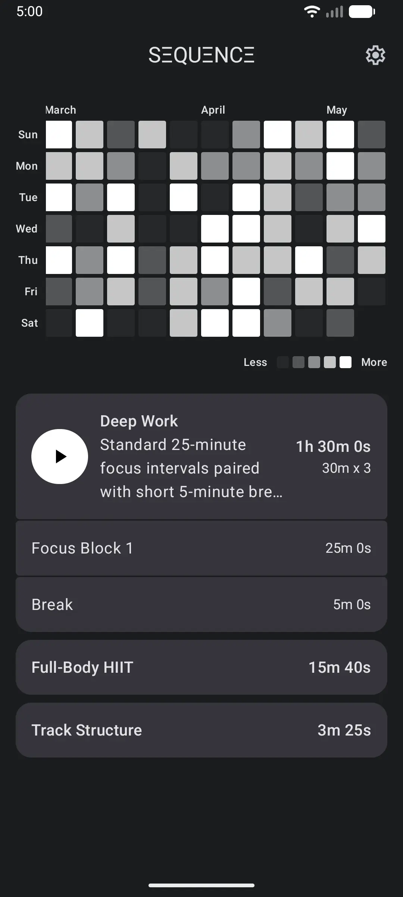
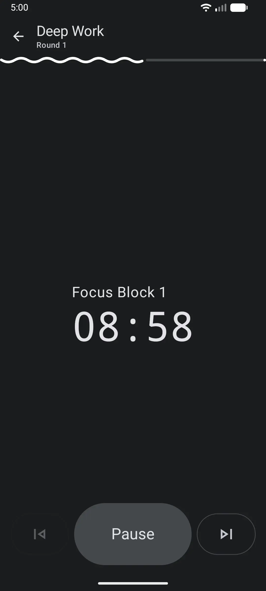
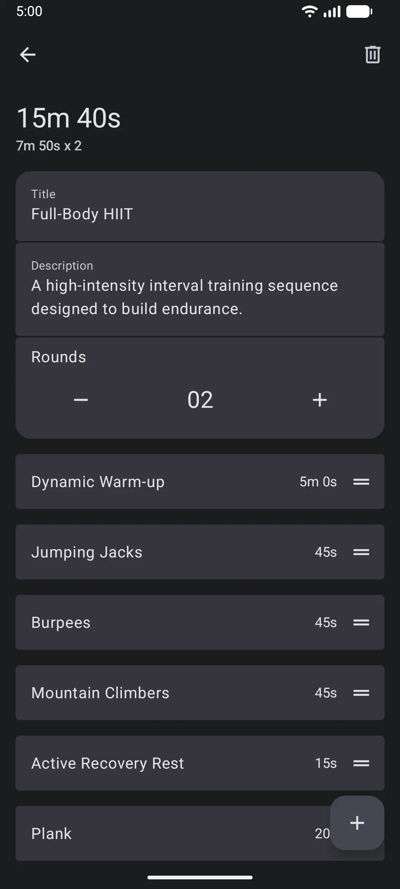
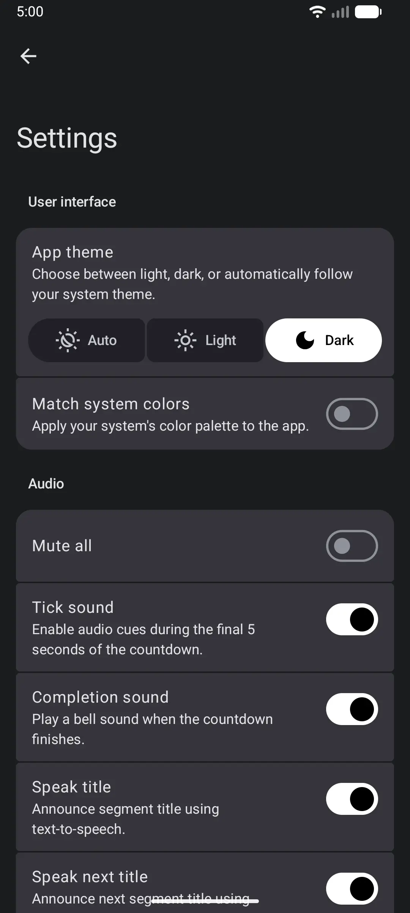
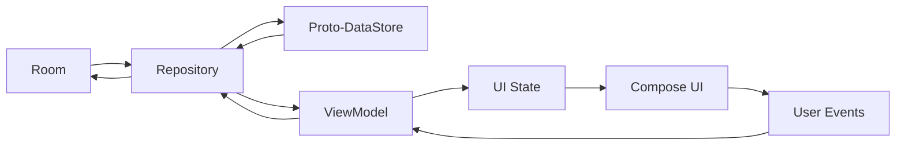
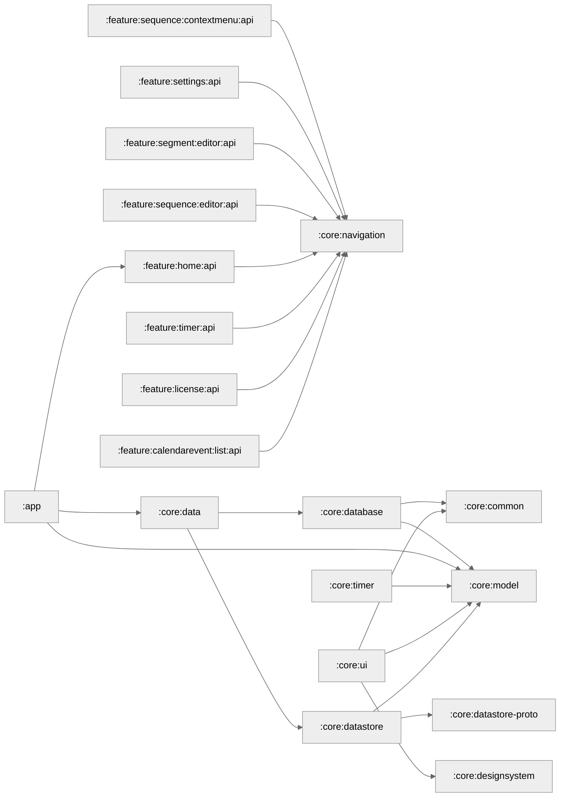
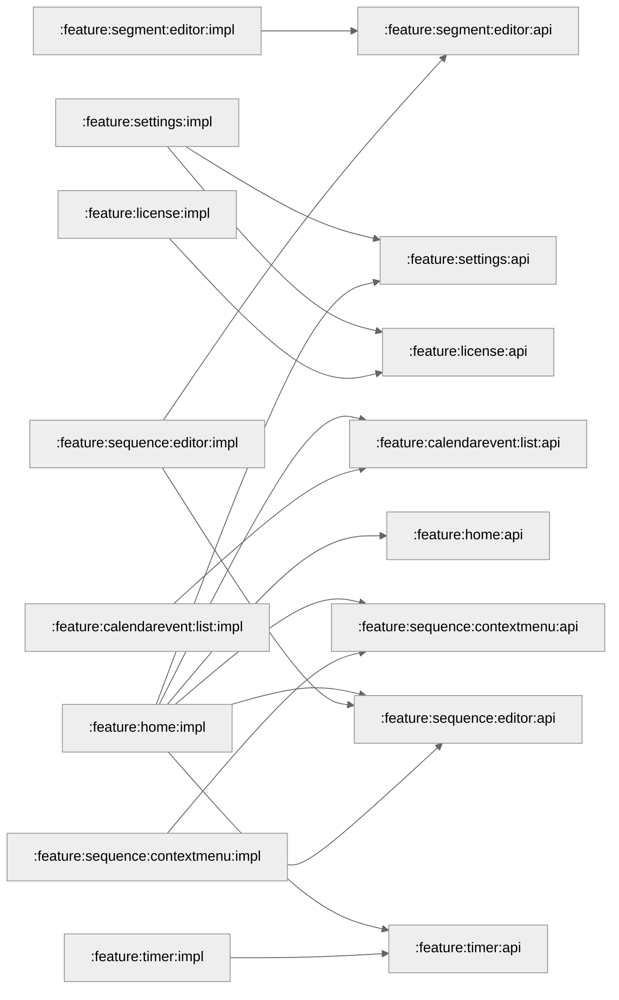
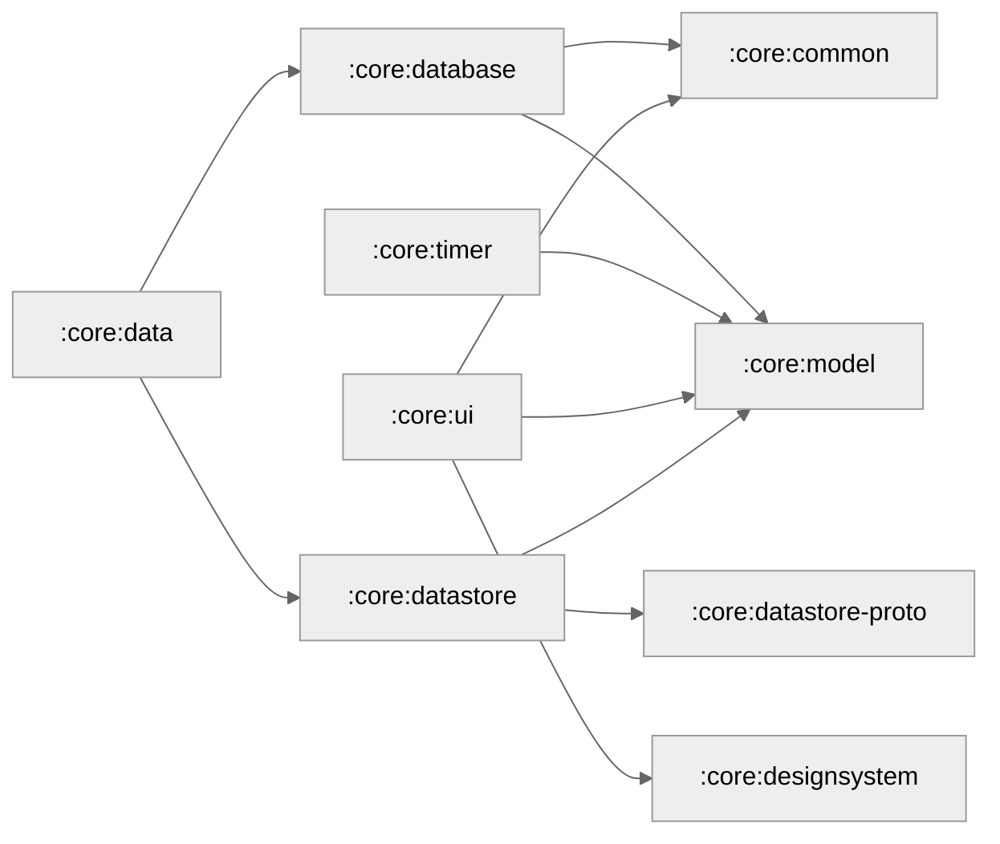

# Sequence

<table>
  <tr>
    <td>
      
    </td>
    <td>
      
    </td>
    <td>
      
    </td>
    <td>
      
    </td>
  </tr>
</table>

Sequence (stylized as SΞQUΞNCΞ) is a sequential timer for structured task execution.

In this app, individual **tasks** are configured as **segments**, and an organized group of these
segments is called a **sequence**.

## Features

- Configurable segment duration (days to seconds).
- Audio cues for completion and time depletion.
- Text-to-speech announcements for segment titles.
- Heatmap visualizing completion times.

## Quick Start

1. Clone the project: `git clone https://github.com/swdegay/Sequence.git`.
2. Open in Android Studio.
3. Sync Gradle and run the `:app` module.

## Development Environment

Use the latest stable Android Studio. If using a custom JDK, ensure it is version 17+ and configured
in [build.gradle.kts](build.gradle.kts).

## Design System

The app UI follows a minimalist philosophy and is structured around a set of design patterns and
components:

* **Card-Based Layouts:** Information is primarily presented by card containers. These are used to
  encapsulate individual list entries and content blocks where necessary.
* **Accordions:** Sequences are presented via card styled accordions. This approach keeps secondary
  information tucked away while maintaining the overall minimalist layout.
* **Material 3 Expressive Components:** The system incorporates Material 3 animations to provide
  visual feedback. This includes:
  * Dynamic progress and loading indicators.
  * Animated button shape transformations triggered by long-press actions.
  * Large top app bars and FAB

### Color and Personalization

The default visual identity is a Monochrome theme, emphasizing contrast and simplicity. To provide a
personalized experience, the app includes a Dynamic Color setting. When enabled, the
application consumes system-level color tokens (such as Android’s Material You wallpaper-based
colors) to seamlessly integrate the interface with the user's personal device theme.

## Architecture

This project employs a multi-module, feature-based structure to ensure separation of concerns and
decoupled code.

### Core Frameworks and Paradigms

* **UI:** 100% Jetpack Compose and Material 3 Expressive on a single activity
* **Navigation:** Navigation3 (api and impl submodules)
* **Persistence:** Room for relational data and Proto-DataStore for preferences/key-value pairs.
* **Dependency Injection:** Hilt
* **Concurrency:** Kotlin Coroutines and Flow

### **Data Flow and State**

The repository acts as an aggregator for relational data and key-value pairs. State flows down from
the repository, consumed by the ViewModel, and exposed as a single UI state for the Compose UI.
Afterward, user events trigger a flow upwards which modify this state and changes flow back down
again to show UI state updates. The UseCase layer was omitted to avoid further over-engineering.

### Modularization

Modularization is based on features supported by shared code in the core modules. This approach also
utilizes
the [API/Implementation](https://developer.android.com/guide/navigation/navigation-3/modularize)
split to expose the least possible code to other modules. In this structure, the following
pattern is
followed:

| Module Pattern                 | Responsibility / Description                                                |
|:-------------------------------|:----------------------------------------------------------------------------|
| `:app`                         | The module that glues all other modules together                            |
| `:feature:[name]:api`          | Navigation keys (References to the feature).                                |
| `:feature:[name]:impl`         | Feature-specific logic, including UI, ViewModels, and entry providers.      |
| `:feature:[model]:[name]:api`  | Navigation keys for the model-specific feature.                             |
| `:feature:[model]:[name]:impl` | Model-specific implementation details for sub-features                      |
| `:core:[name]`                 | Reusable foundation modules (e.g., navigation, database, or design system). |

#### Gradle Configuration

Common configuration for dependencies such as Jetpack Compose and Hilt are encapsulated into Gradle
convention plugins. This enables modular reuse by plugin ID, eliminating boilerplate across the
project `build.gradle.kts` files.

#### App Module Dependency Graph

The app module serves as the project's central orchestrator. It uses Hilt to inject feature
implementations for navigation and manages access to the design system theme and user preferences.

#### Feature Modules Dependency Graph

This graph maps the boundaries between feature implementations and their public APIs, showing how
features navigate to or reference each other exclusively through `:api` modules.

#### Core Modules Dependency Graph

This graph details the internal dependency tree of the foundational, non-feature modules responsible
for data persistence, business models, and shared UI styling.

## License

This project is licensed under the GNU General Public License v3. See the [LICENSE](LICENSE) file
for details.